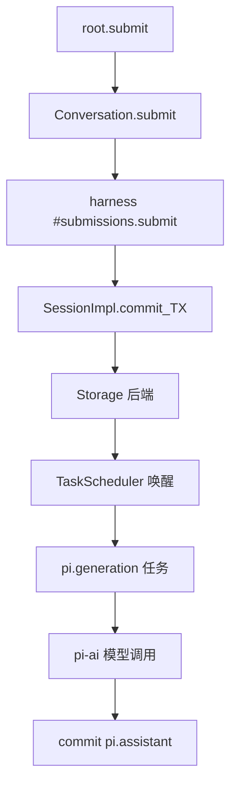

# 第 5 章 Harness 层:从存储原语到对话语义

`src/harness/*` 是 pi-durable 的"操作系统外壳":把 Session 的事务能力翻译成业务语义——对话、任务、提交记录。读完本章,你应当能够回答:**一次用户输入从 `Harness.root()` 汇入到"模型回复落盘"要经过几层调用?**

## 5.1 一张调用栈地图

一条输入从上到下的层级关系(以 `test/examples/14-chat.ts` 为参考):

1. 调用方得 `Conversation` 处理器:`const root = await harness.root(context)`。
2. 提交输入:`root.submit({ type: "input", content: "..." }, context)`。
3. `Conversation.submit()` 委托给 `harness` 里的 `#submissions.submit()`(在 `harness/submissions.ts`)。
4. `Submissions.submit()` 通过 `SessionImpl.commit()` 在一个事务里创建 record,返回一条 `Submission` 记录。
5. 任务调度器 `harness/scheduler.ts` 看到 `pi.user` RootTask,开始调度 `pi.generation` 任务。
6. `pi.generation` 走一轮模型调用,得到 assistant 回复,仍在一个事务里落盘。



## 5.2 Session、Conversation 与 Harness 的层级关系

Surface API 在包入口入口 (`index.ts`) 导出三样:

```ts
export { createSession } from "./session/session.ts";
export { MemoryStorage } from "./storage/memory.ts";
export { Harness } from "./harness/harness.ts";
```

· `createSession(storage)` 允许你**绕开 pi-durable 业务层,直接用事务原语建模**自己的业务对象;`Harness.open(...)` 则把 Session 与 Agent、任务调度器、工具注册表等装配成一个可交付运行的 Agent 运行时。

每个对象各自“处事责任”分派:

- **客户端只接触 `Harness` 与 `Conversation`**: `Harness` 同派管理存储生命周期和 Agent 侧状态。定义在 `harness/harness.ts`。
- **`Session` / `Tx` 是事务原语**: 上层封装为 pi-durable 的公共 API, 下层在 `session/*`。
- **`Task` 与 `defineTask()`**: 用极少量 API 暴露出“持久化状态机”—学习者如果想在别的 backend 中写自己的任务系统,应当只引入这一层。

## 5.3 Harness.open:启动时刻的职责清单

从 `harness/harness.ts` 的构造过程, 能看見启动时 pi-durable 干活的三件事:

1. **初始化运行态读取器**：把上一轮运行后留下的"已提交状态"重新读进内存。
2. **初始化 task scheduler**: `pi.tool`、`pi.generation` 等内置任务注入注册表, 后续通过恢复进程可继续。
3. **打开后端**：取得 `Storage` 实现对象，等它就绪（例如 SQLite 后端会打开数据库并跑 migrations）。

## 5.4 持久化任务模型:pi.tool, pi.generation 与 terminal

pi-durable 不是把 Agent 循环写成 async 代码并“随缘忘记”。关键突破:
每个 tool-bash、message 调用都是一个**Task**;Task 内含**任务阶段 phase** (`prepare` / `request` / `answer`),每段阶段内部都会**先写 checkpoint 再执行**。若进程重启, 重建 accessor 后从最后 checkpoint 恢复。

重放成本分两大类:

- **重放安全**(`replay: "safe"`):重复执行无副作用;执行中中断后从 checkpoint 恢复再跑。
- **非安全**(`replay: "unsafe"`):重复执行有副作用;重启后就“放弃”,向模型返回带错误提示的结果。

`harness/tool.ts` 就是它实现的设施之一: `ToolExecutionApi.output()`、`output()` 皆有“如果 replay safe”的语义。

## 5.5 从 Harness 到多轮 Abrupt 对话的生命周期

pi-durable 的对话中去大多有三种结束:

- **正常回答**:`done` — 已落盘巴纳台模型最终回复。
- **异常**:`unanswered`, 管道当时并没有把最终 assistant 输出写完。
- **中断**:`Error` / `answered` 都常代以上;父对话对此提供导。

## 5.6 Reading list

- `packages/durable/src/harness/harness.ts:150`—`HarnessImpl`檔案。`harness.open()` 入口。
- `packages/durable/src/harness/submissions.ts:61`—`Submissions` 实现解析处。
- `packages/durable/src/harness/scheduler.ts:99`—任务调度器核心。
- `packages/durable/src/harness/task-graph.ts:41`—全局任务依赖视图。
