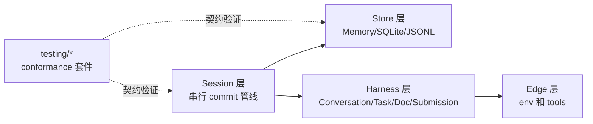
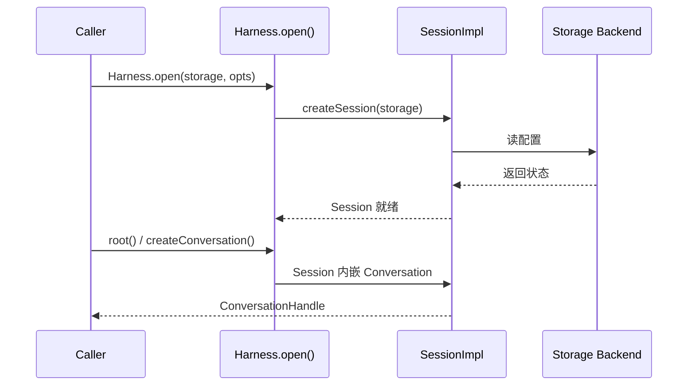

# 第 1 章 全景与源码地图

> **本章目标**：不看代码先建立一个粗略的心智模型。读完你会知道 pi-durable 在解决什么问题，它的总体架构分了几层，每一层负责一块什么，以及后面几章会沿着哪条路线带你在源码里逐层穿透。

pi-durable（npm 包 `@earendil-works/pi-durable`）是一个**可持久化 Agent 运行时**：对话、模型回合、工具调用和你自己的状态，都在展示给用户之前先提交到存储；进程中途崩溃，重新打开后从上次提交点继续向上执行。它在公开 API 中以 `Harness` 为中心，README 自述为 "a durable agent harness"。

为了让"可持久化"不是一句口号，pi-durable 在 public API 之下分了四层：

1. **Session 层**（`src/session/*`）：核心是 `SessionImpl`，一个 "single mutation line" 的串行化执行器，把同一个 commit 的多步读写按内部 prepare 与存储落地的顺序收敛。
2. **Store 层**（`src/storage/*`）：`MemoryStorage`、`openNodeSqliteStorage`、`openNodeJsonlStorage` 三个后端，同一套 `Storage` 契约。
3. **Harness 层**（`src/harness/*`）：把 Session 的事务与文档能力包装成业务对象：`Conversation`、`Task`、`Document`、`Submission`。
4. **Edge 层**（`src/{env,tools}/*`）：每一步工具调用落到真实文件系统或子系统时走的通道。

在源码里这四层被严格隔离：`session/session.ts` 不认识 Agent；`harness/harness.ts` 依赖 Session 的内部接口而不是直接读写 Storage；`storage/*` 只遵守 `Storage` 契约。

整个 `src/` 目录下的六个主要子目录画出全景：

## 1.1 精读路线地图

按"从内层到外层"的顺序，本书章节对应这些源码对象：

| 章 | 看什么 | 为什么 |
|---|---|---|
| 第 2 章 | `package.json` 与构建相关文件 | 依赖：chord、pi-ai |
| 第 3 章 | `src/session/*` | 单一 mutation line 的核心并发管线 |
| 第 4 章 | `src/storage/*` | 三个后端如何实现同一条 Storage 契约 |
| 第 5 章 | `src/harness/*` | Session 语义如何外化为业务对象 |
| 第 6 章 | `harness/tool.ts`、`src/tools/*` | 工具如何调度、执行、提交和重放 |
| 第 7 章 | `src/testing/*` | 自定义后端与环境的一致性验收 |
| 第 8 章 | `harness/scheduler.ts`、`docs/spec.md` | 任务状态机与跨后端契约 |
| 第 9 章 | `src/harness/define.ts`、`docs/spec.md` | 扩展、钩子、工具的组装语义 |

## 1.2 一分钟心智模型

一句话版：

> pi-durable 把 Agent 过程中的事件先写成事务，经 Session 串行化落地三选一的 Store 后端，再在 Harness 层把事务结果外化为对话、任务与工具状态。

再细一层：

- 对外的主要接口是 `Harness`（工厂 `Harness.open(storage, opts)`、`root()`、`createConversation()`、`fork()`）。
- `Harness.open()` 内部先 `createSession(storage)`，把一个 `Storage` 后端交给 `SessionImpl`，再装配 `TaskScheduler` 等运行配件。
- `Conversation.submit()` → `Submissions.submit()` → `SessionImpl.commit()`；一次 `Tx` 事务是所有状态的写入通道。
- "先入库再展示"依赖 Session 层不变式：可见状态全部来自已提交数据。

## 1.3 与 pi 主仓库的关系

pi-durable 是 pi 主仓库 `packages/durable` 下的一个包。上游 pi 也发布独立包 `@earendil-works/pi-agent-core`（内存 runtime），两者定位不同：`pi-agent-core` 是最简内存循环，pi-durable 则是**持久化内核加安全隔间**（先提交、再执行），两者共享 `Conversation` / `requestId` / `Tool` 等类型由 pi-ai 统一约定。

> 参考书：《pi-book》第 11 章"会话树 - 比"聊天记录"更好的数据模型"。
