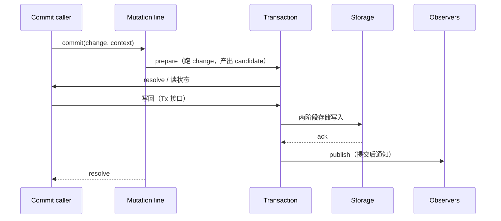

# 第 3 章 Session 层：串行化 commit 管线

pi-durable 的"durable"承诺，最终都归根到一处：**一次 `Session.commit()` 是原子提交**。原子提交这一层的责任全部落在 `src/session/session.ts` 的 `SessionImpl` 上。本章带你看它如何用一条串行的 mutation line 把并发请求排成一队，同时不让自己成为死锁源头。

## 3.1 为什么要一条 mutation line

同一时刻可能有多个调用方正在往同一个 Session 里写：一个提交消息、一个写工具结果、一个做 compaction。这些调用从上层看要彼此"一次性"，并且**只有提交成功后的内容才能被别人读到**。

最朴素的实现是加一把大锁。pi-durable 选了更工程化的路：**把所有 commit 排在一条 `#tail: Promise<void>` 上**（`session.ts` 源码里叫 mutation line）。每个 commit 实际是 `this.#tail = this.#tail.then(job)` 的手工链式排程——上一个 commit 没走完，下一个连 prepare 都不开始。

这样做换来了什么？

- 所有可见操作都串行，不需要再引入锁。
- commit 失败时可以直接 `#poison` 整个 Session，不必处理"半提交"的残留状态。
- `Storage` 后端也只需要支持单进程单瓶颈：一条 mutation line 的底层就是"同一时间只跑一个事务"。

`session.ts` 注释里说得很清楚（原文）：

> Only committed state is observable. Every commit callback, preparation, Storage settlement, adoption, and publication enqueue runs while the line is held; listeners run later.

## 3.2 commit 生命周期

一次完整 commit 走五个阶段：



核心入口是 `commitWith()`（`session.ts:80` 左右）：

```ts
commitWith<T>(change, context, scope?) {
  this.#assertUsable();
  return this.#enqueue(() => this.#runCommit(change, context, scope));
}
```

`#enqueue` 只做一件事：把 `#runCommit` 追加到 mutation line 尾部。`#runCommit` 内部则做 prepare 和 publish 两件事。对读请求（不需要写）也有独立入口 `readOnLine()`：同样占用 mutation line，但不产写，适合"要在多读之前看到一致快照"的场景。

## 3.3 Session 与 Storage 的边界

`session/` 只看见 `types.ts` 里定义的 `Storage` 结构化接口，`session/` 不关心底层是 SQLite、JSONL 还是 `Map`。一次 commit 产出的写入请求在存储层被明确划分为两类：

- **table 写**：`conversation` / `entry` / `task` / `submission` 等记录的追加或替换。
- **document 写**：Chord 管理的结构化文档，分 base 和 delta 两种 revision，分 `create` 或 `change` 两种动作。

`memory.ts` 里把这两类都固化到一组 `Map`；`sqlite/storage.ts` 落到表的 `INSERT INTO … json_valid` 约束行；`jsonl/storage.ts` 则先把调用方写请求序列化成行，再在 `main.jsonl` 里追加一个 commit marker。三种后端语义一致，pi-durable 能做到换后端不改业务代码。

## 3.4 Session 对外接口

`Session` 接口（`src/session/session.ts` 导出的 `Session` 类型）暴露对 `Tx` 与观察者的能力，但没有业务级对象（`Conversation`、`Submission` 等概念不在这一层）。`Harness` 在上层调用 `Session` 任何时间内都假定：

- 同一时间只有一个 `change` 在跑。
- 该 `change` 的写入不会部分可见。
- 该 `change` 抛异常，则整个 commit 失败——已进 `Tx` 的写全部丢弃。

`#poison` 有两个来源：`#runCommit` 内异常逃逸（unexpected），或 `Storage` 写失败。任何一条都会让 Session 主动拒绝后续请求。这是刻意保守的设计：**宁可关闭，不可留下"陈旧但合法"的 Session**。

## 3.5 观察者模型

`#commitListeners` 与 `#closeListeners` 不是业务事件总线；pi-durable 的对象定义把两个队列做成"反射已提交数据"的观察组，而不是向外广播的广播器。`CommitPublication` 是结构化快照，而不是事件流——也就是 `Harness` 层基于它构建 `ConversationView` 等只读视图的原料。

## 3.6 从 Session 到 Chord 文档

Chord 在 pi-durable 的角色是："**为结构化文档做 delta 追踪与补丁计算**"。`Session.commit()` 只关心节点；文档里每一条修改都会被切成 base（新文档整个值）或 delta（结构化补丁，`Op[]`），然后交给存储后端保存。

`LoadedDocument`（`transaction.ts`）是 tracker 状态的核心（关键注释）：

```ts
/** Persisted definition version; older while the tracked value is migrated only in memory. */
storedVersion: number;
/** Definition version whose shape the tracked value has; access with another version reloads from Storage. */
readonly valueVersion: number;
```

这个版本对是"文档 schema 演化"的攻防阵地。如果用户在自己代码里用 `defineDoc()` 声明 `version: 2` 而存盘的是 `version: 1`，`load()` 会带上定义的 `migrations` 参数，把老值升级到 `version 2` 的形状。`deltasSinceBase` 存的是"自最近一次 base（version 落盘）起累计的 delta 数"，只做统计，不涉及数据正确性。

## 3.7 小结与阅读清单

- `SessionImpl` 用一条 mutation line 把所有 commit 串行；失败即整个 Session 中毒。
- commit 过程 = 跑 change（读/写）→ 两阶段存储写入 → sync observers → publish。publish 只在存储成功后发生。
- 三个 `Storage` 后端（memory / SQLite / JSONL）共享同一套 `StorageWrite` 契约。
- 文档 schema 演化靠 `storedVersion` / `valueVersion` 版本对判定，migrations 在 `load()` 时发生。

**阅读清单**：

- `src/session/session.ts:37`——`SessionImpl` 类定义。
- `src/session/session.ts:80`——`commitWith()`。
- `src/session/transaction.ts:44`——`TransactionHost` 接口，连接 `Session` 与 `Tx`。
- `src/types.ts`——`Session`、`Tx`、`StorageWrite` 等类型的定义来源。
